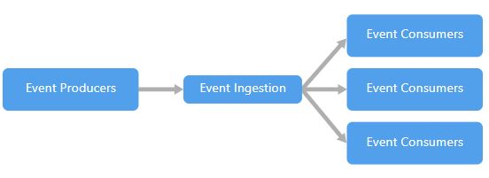
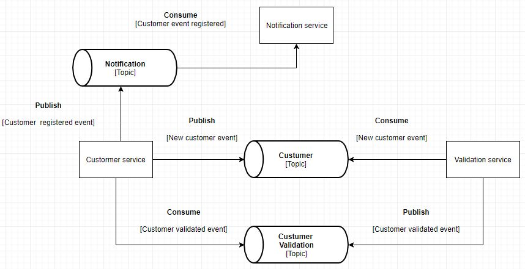

# Arquitetura orientada a eventos (POC)

Repositório usado como uma prova conceitual do apache kafka na arquitetura orientada a eventos.



**Requisitos:**

* Dotnet Core 2.2+
* C#
* Apache Kafka 2.2.0
* Apache ZooKeeper
* Confluent's .NET Client for Apache Kafka 1.1.0

# Objetivo

O objetivo dessa POC é mostrar um exemplo de comunicação de 3 serviços distintos utilizando o Kafka como centralizador e distribuidor dos eventos.

O fluxo esperado é que o serviço `ClientService.ConsoleApp` cadastre clientes com base nas informações inseridas pelo usuário (Nome e CPF). 

Esse cadastro não é salvo diretamente no banco de dados, antes ele precisa ser validado pelo serviço `ValidationService.ConsoleApp` que, após a validação, insere o mesmo cadastro no tópico `CustomerValidation`. 

Após a validação, o serviço `ClientService.ConsoleApp` identifica que o cadastro foi validado e envia uma notificação para o tópico `CustomerNotification`. 

O serviço `NotificationService.WebApi` (que também é uma API) identifica que existe uma notificação e a exibe no console.

A imagem abaixo demostra todo esse fluxo:



O serviço `NotificationService.WebApi` também contém uma simulação de importação de cotações no tópico `Quotes`, ou seja, é uma demostração de "produção de dados" em background sem a necessidade de inputs de usuários. Para fins de exemplo, esse mesmo serviço cria um "ouvinte" para esse mesmo tópico que exibe a informação no console quando uma nova cotação é inserida.

# Executando a POC

Para executar a POC é necessário executar os 3 projetos:

## Executando o `ClientService`

Ao executar esse serviço (que é um console application), você deve inserir o nome e CPF do cliente. Após isso ele deve fazer o registro do dado no tópico do Kafka e se tudo ocorrer bem, você deve visualizar uma mensagem confirmando o registro.

```
cd client-service\ClientService.ConsoleApp
dotnet run
Type the customer name and press enter
Meu nome
Type the customer CPF and press enter
1234567890
[Register] Customer registered: '1234567890'; status: 'Received'
```

## Executando o `ValidationService`

Ao executar esse serviço (que é um console application) você deve visualizar  mensagens sempre que um novo cliente for inserido.

```
cd validation-service\ValidationService.ConsoleApp
dotnet run
[Validate] Customer validated: CPF: '1234567890'; status: 'Actived'
```

## Executando o `NotificationService`

Ao executar esse serviço (que é um WebApi) você deve visualizar mensagens sempre que uma notificação for enviada, ou seja, após a validação do cliente.

```
cd notification-service\Notification.WebApi
dotnet run
[Reveive Notification] '1234567890'; status: 'Actived'
```

# Configurações dos produtores

Estamos utilizando as seguintes configurações nos produtores:

* **BootstrapServers** (bootstrap.servers): Define a lista (separada por vírgula) do par "host:porta" de cada broker.

**Observação:**

 A quantidade de configurações e seus respectivos valores podem aumentar com o decorrer da evolução da POC.

# Configurações dos consumidores

Estamos utilizando as seguintes configurações nos consumidores:

* **BootstrapServers** (bootstrap.servers): Define a lista (separada por vírgula) do par "host:porta" de cada broker.
* GroupId (group.id): Especifica o nome do grupo de consumidores ao qual um consumidor do Kafka pertence. O grupo é criado automaticamente caso ele não exista.
* **EnableAutoCommit** (enable.auto.commit): Por padrão, como o consumidor lê as mensagens do Kafka, ele periodicamente confirma seu deslocamento atual (definido como o deslocamento da próxima mensagem a ser lida) para as partições que ele está lendo de volta para o Kafka. Muitas vezes você gostaria de ter mais controle sobre quando as compensações são confirmadas. Neste caso, você pode definir enable.auto.commit para `false` e chamar o `commit` método do consumidor.
* **AutoOffSetReset** (auto.offset.reset): Quando não houver deslocamento inicial no Kafka ou se o deslocamento atual não existir mais no servidor (por exemplo, porque esses dados foram excluídos):
    * mais cedo: redefine automaticamente o deslocamento para o deslocamento mais antigo
    * mais recente: redefine automaticamente o deslocamento para o mais recente deslocamento
    * none: lançar exceção para o consumidor se nenhum offset anterior for encontrado para o grupo do consumidor
    * qualquer outra coisa: lançar exceção ao consumidor.
* **EnablePartionEof** (enable.auto.commit): Automaticamente e periodicamente consolide offsets em segundo plano. Nota: definir isso como false não impede que o consumidor busque compensações iniciais comprometidas anteriormente. Para contornar esse comportamento, defina deslocamentos iniciais específicos por partição na chamada.